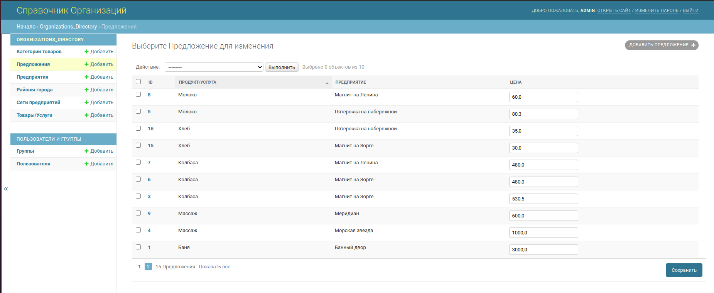

# Organizations_directory

Микросервис представляет собой справочник организаций.

Стек:

    - Django
    - DjangoRestFramework
    - Docker

## Разворачивание на машине разработчика

* Клонируем [Organizations_directory](https://github.com/Dmitry-Klevakov/organizations_directory.git).
* Переходим в директорию organizations_directory и собираем образ проекта:

  ```bash
  docker build -t organizations_directory -f docker/Dockerfile .
  ```

* Переходим в директорию docker и запускаем созданный образ вместе с образом сервера баз данных:

  ```bash
  docker-compose up
  ```


## Схема базы данных


## Описание панели администратора

В панели администратора доступно создание и редактирвоание сущностей системы



